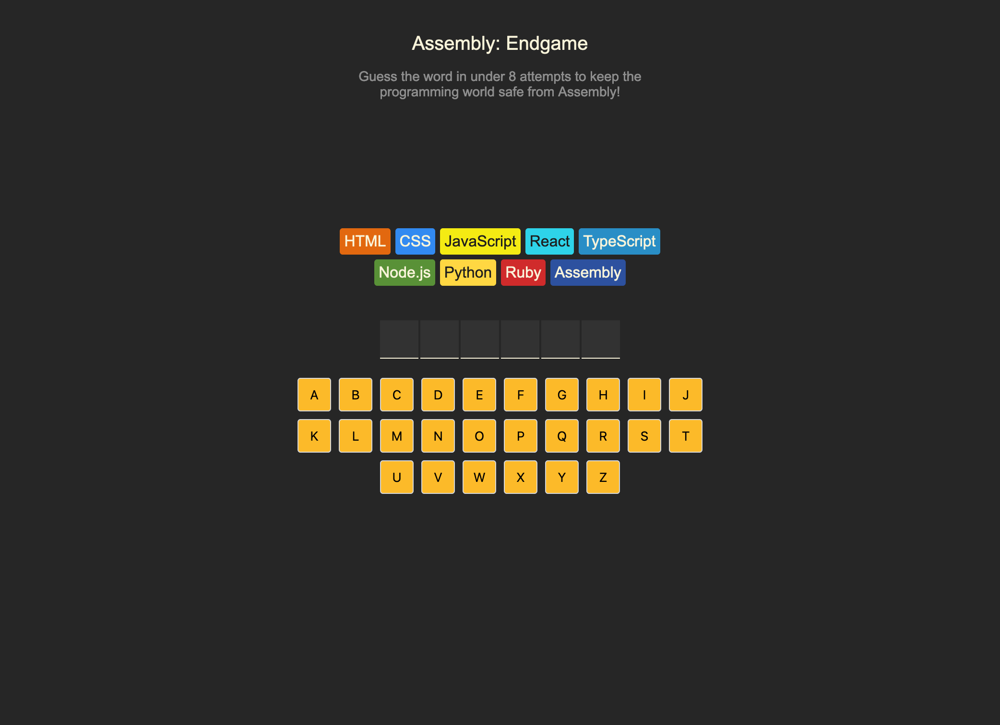

# Assembly: Endgame

The project was developed in educational purpose while studying Learn React course on [Scrimba](https://scrimba.com/learn-react-c0e).

## Table of contents

- [Overview](#overview)
  - [Details](#details)
  - [Screenshot](#screenshot)
- [My process](#my-process)
  - [Built with](#built-with)
- [Demo](#demo)

## Overview

### Details

This is a variation of the Hangman game. The goal is to guess the word before the pool of available programming languages is reduced to just Assembly (8 attempts). Once only Assembly is left, the game is over.

Rules:
• The player has 8 attempts. Each incorrect guess removes one programming language from the pool.
• If all attempts are exhausted and only Assembly remains, the game ends in a loss.
• The player can make guesses using either a custom on-screen keyboard or a regular keyboard.

May the Luck Be With You!

### Screenshot

## My process

### Built with

- [React](https://reactjs.org/) - JS library
- [Typescript](https://www.typescriptlang.org/) - programming language
- [Vite](https://vitejs.dev/) - Build tool
- [ESlint](https://eslint.org/) - static code analysis tool for identifying problematic patterns found in JS code
- [Github Pages](https://pages.github.com/) - for deployment

## Demo

Live Site URL: https://alla-r.github.io/SCRIMBA-assembly-endgame/
